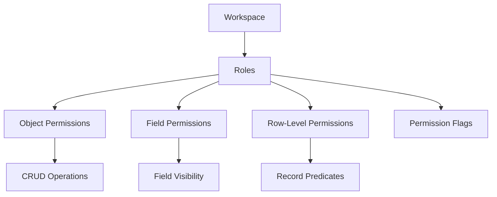

Twenty's permission system gives you granular control over who can access and modify data in your workspace. Create custom roles with specific permissions at the object, field, and record level.

## Permission model overview

Permissions in Twenty work through a hierarchical system:



## Roles

Roles are the foundation of the permission system. Each workspace member is assigned one or more roles that determine their access.

### Standard roles

Twenty includes default roles:

- **Admin**: Full access to all data and settings
- **Member**: Standard access to CRM features
- **Guest**: Limited read-only access

### Custom roles

Create roles tailored to your organization:

<Steps>
  <Step title="Navigate to Roles">
    Go to Settings → Workspace → Roles
  </Step>
  
  <Step title="Create new role">
    Click "New Role" and configure:
    
    - **Label**: Role name (e.g., "Sales Manager", "Support Agent")
    - **Description**: What this role is for
    - **Icon**: Visual identifier
  </Step>
  
  <Step title="Configure permissions">
    Set role-wide permissions:
    
    - Can update all settings
    - Can access all tools
    - Can read all object records
    - Can update all object records
    - Can soft delete all object records
    - Can destroy all object records
  </Step>
  
  <Step title="Set object permissions">
    Define specific permissions per object (covered below).
  </Step>
</Steps>

### Role properties

<CodeGroup>
```typescript Role Configuration
{
  label: "Sales Manager",
  description: "Manages sales team and pipeline",
  icon: "users",
  
  // Global permissions
  canUpdateAllSettings: false,
  canAccessAllTools: true,
  canReadAllObjectRecords: true,
  canUpdateAllObjectRecords: false,
  canSoftDeleteAllObjectRecords: false,
  canDestroyAllObjectRecords: false,
  
  // Assignment options
  canBeAssignedToUsers: true,
  canBeAssignedToAgents: false,
  canBeAssignedToApiKeys: false,
  
  // Editability
  isEditable: true
}
```
</CodeGroup>

<Info>
  Roles can be assigned to users, AI agents, and API keys, allowing you to control permissions for both human and programmatic access.
</Info>

## Object permissions

Control what actions roles can perform on each object.

### CRUD permissions

Four basic permissions for each object:

- **Create**: Can create new records
- **Read**: Can view records
- **Update**: Can modify existing records
- **Delete**: Can soft-delete or permanently remove records

### Setting object permissions

<Tabs>
  <Tab title="Via UI">
    1. Go to Settings → Roles
    2. Select a role
    3. Navigate to "Object Permissions"
    4. For each object, toggle permissions:
    
    ```
    Object: Companies
    ✓ Create
    ✓ Read
    ✓ Update
    ✗ Delete
    
    Object: Opportunities
    ✓ Create
    ✓ Read
    ✓ Update
    ✓ Delete
    ```
  </Tab>
  
  <Tab title="Via API">
    ```graphql
    mutation UpdateObjectPermission {
      updateObjectPermission(
        roleId: "role-uuid",
        objectId: "object-uuid",
        permissions: {
          canCreate: true,
          canRead: true,
          canUpdate: true,
          canDelete: false
        }
      ) {
        id
        permissions
      }
    }
    ```
  </Tab>
</Tabs>

### Permission inheritance

<Warning>
  Delete permission requires Update permission. You cannot delete records you cannot update.
</Warning>

Permissions have implicit dependencies:

- `canDelete` requires `canUpdate`
- `canUpdate` requires `canRead`
- Without `canRead`, the object is invisible to the role

## Field permissions

Restrict access to specific fields within objects.

### Field visibility

Control which fields roles can see and edit:

- **Visible**: Field appears in views and forms
- **Editable**: Field can be modified
- **Hidden**: Field completely hidden from role

### Use cases for field permissions

<Tabs>
  <Tab title="Sensitive Data">
    Hide confidential information:
    
    - **Social Security Numbers**: Visible only to HR role
    - **Salary information**: Visible only to Finance role
    - **API keys**: Visible only to Admin role
    - **Credit card info**: Never visible to any role
  </Tab>
  
  <Tab title="Read-only Fields">
    Allow viewing but prevent editing:
    
    - **Created date**: Everyone can see, nobody can edit
    - **Record owner**: Sales reps can see, only managers can change
    - **Approval status**: All see, only approvers edit
  </Tab>
  
  <Tab title="Role-specific Fields">
    Show fields only to relevant roles:
    
    - **Internal notes**: Visible to employees, hidden from clients
    - **Cost price**: Visible to procurement, hidden from sales
    - **Technical details**: Visible to support, hidden from sales
  </Tab>
</Tabs>

### Configuring field permissions

```typescript Field Permission Example
// Object: Company
// Role: Sales Rep

Fields:
  name:               { visible: true,  editable: true  }  // Full access
  annualRevenue:      { visible: true,  editable: false }  // Read-only
  internalNotes:      { visible: false, editable: false }  // Hidden
  owner:              { visible: true,  editable: false }  // Read-only
  industry:           { visible: true,  editable: true  }  // Full access
```

<Tip>
  Use field permissions to implement progressive disclosure: show simple fields to all users, advanced fields only to power users.
</Tip>

## Row-level permissions

Define which specific records a role can access based on field values.

### Permission predicates

Predicates are conditions that determine record visibility:

<CodeGroup>
```typescript Simple Predicate
// Sales reps can only see their own opportunities
{
  field: "ownerId",
  operator: "eq",
  value: "{{currentUser.id}}"
}
```

```typescript Multiple Conditions (AND)
// Support agents see tickets in their region and unresolved
{
  logicalOperator: "AND",
  predicates: [
    { field: "region", operator: "eq", value: "{{currentUser.region}}" },
    { field: "status", operator: "ne", value: "RESOLVED" }
  ]
}
```

```typescript Multiple Conditions (OR)
// Managers see their team's records OR high-value accounts
{
  logicalOperator: "OR",
  predicates: [
    { field: "ownerId", operator: "in", value: "{{currentUser.teamMemberIds}}" },
    { field: "annualRevenue", operator: "gt", value: 1000000 }
  ]
}
```
</CodeGroup>

### Predicate operators

Available operators for row-level predicates:

- **eq**: Equals
- **ne**: Not equals
- **gt**: Greater than
- **gte**: Greater than or equal
- **lt**: Less than
- **lte**: Less than or equal
- **in**: In array
- **notIn**: Not in array
- **contains**: String contains substring
- **startsWith**: String starts with
- **endsWith**: String ends with
- **isEmpty**: Field is null or empty
- **isNotEmpty**: Field has a value

### Dynamic predicates

Use variables to make predicates dynamic:

```typescript Dynamic Variables
// Current user
{{currentUser.id}}
{{currentUser.email}}
{{currentUser.teamId}}
{{currentUser.role}}

// Related records
{{currentUser.managedTeamIds}}  // Array of team IDs user manages
{{currentUser.regionId}}         // User's assigned region

// Workspace context
{{workspaceId}}
```

### Example row-level permissions

<Tabs>
  <Tab title="Sales Territory">
    ```typescript
    // Sales reps see accounts in their territory
    Role: Sales Rep
    Object: Company
    
    Predicate:
    {
      logicalOperator: "OR",
      predicates: [
        // Accounts they own
        { field: "ownerId", operator: "eq", value: "{{currentUser.id}}" },
        // OR accounts in their territory
        { field: "territory", operator: "eq", value: "{{currentUser.territory}}" }
      ]
    }
    ```
  </Tab>
  
  <Tab title="Team Hierarchy">
    ```typescript
    // Managers see their team's records
    Role: Manager
    Object: Opportunity
    
    Predicate:
    {
      field: "ownerId",
      operator: "in",
      value: "{{currentUser.teamMemberIds}}"
    }
    ```
  </Tab>
  
  <Tab title="Customer Portal">
    ```typescript
    // Clients see only their own data
    Role: Client
    Object: Project
    
    Predicate:
    {
      field: "clientCompanyId",
      operator: "eq",
      value: "{{currentUser.companyId}}"
    }
    ```
  </Tab>
  
  <Tab title="Multi-condition">
    ```typescript
    // Support sees active tickets in their queue
    Role: Support Agent
    Object: Ticket
    
    Predicate:
    {
      logicalOperator: "AND",
      predicates: [
        {
          // Assigned to them OR unassigned
          logicalOperator: "OR",
          predicates: [
            { field: "assignedTo", operator: "eq", value: "{{currentUser.id}}" },
            { field: "assignedTo", operator: "isEmpty" }
          ]
        },
        // AND not resolved
        { field: "status", operator: "ne", value: "RESOLVED" }
      ]
    }
    ```
  </Tab>
</Tabs>

<Warning>
  Row-level permissions can impact query performance on large datasets. Use indexed fields in predicates for better performance.
</Warning>

## Permission flags

Binary permissions for workspace-level features.

### Available permission flags

Flags control access to workspace features:

<CodeGroup>
```typescript Permission Flags
// Workspace settings
CAN_ACCESS_WORKSPACE_SETTINGS
CAN_EDIT_WORKSPACE_SETTINGS

// Data model
CAN_CREATE_OBJECTS
CAN_EDIT_OBJECTS
CAN_DELETE_OBJECTS
CAN_CREATE_FIELDS
CAN_EDIT_FIELDS
CAN_DELETE_FIELDS

// Workflows
CAN_CREATE_WORKFLOWS
CAN_EDIT_WORKFLOWS
CAN_DELETE_WORKFLOWS
CAN_EXECUTE_WORKFLOWS

// Users and permissions
CAN_INVITE_USERS
CAN_MANAGE_USERS
CAN_MANAGE_ROLES
CAN_ASSIGN_ROLES

// Integrations
CAN_MANAGE_API_KEYS
CAN_MANAGE_WEBHOOKS
CAN_INSTALL_APPS

// Data
CAN_IMPORT_DATA
CAN_EXPORT_DATA
CAN_DELETE_ALL_DATA
```
</CodeGroup>

### Assigning permission flags

```typescript Role with Flags
{
  label: "Developer",
  permissionFlags: [
    "CAN_ACCESS_WORKSPACE_SETTINGS",
    "CAN_MANAGE_API_KEYS",
    "CAN_MANAGE_WEBHOOKS",
    "CAN_CREATE_WORKFLOWS",
    "CAN_EDIT_WORKFLOWS",
    "CAN_EXPORT_DATA",
    "CAN_IMPORT_DATA"
  ]
}
```

## Workspace members

Manage who has access to your workspace.

### Inviting users

<Steps>
  <Step title="Go to Settings → Members">
    View all workspace members and pending invitations.
  </Step>
  
  <Step title="Click Invite Member">
    Enter email address of person to invite.
  </Step>
  
  <Step title="Assign role">
    Choose which role(s) to assign to the new member.
  </Step>
  
  <Step title="Send invitation">
    User receives email with link to join workspace.
  </Step>
</Steps>

### Member properties

- **Email**: User's email address
- **Role(s)**: Assigned roles (can have multiple)
- **Status**: Active, Invited, Suspended
- **Locale**: User's language preference
- **Avatar**: Profile picture
- **Last active**: Last login timestamp

### Removing access

1. Go to Settings → Members
2. Click on user to remove
3. Choose:
   - **Suspend**: Temporarily disable access (can be restored)
   - **Remove**: Permanently remove from workspace

<Warning>
  Removing a user does not delete records they created. Records remain but show "[Deleted User]" as the creator.
</Warning>

## Best practices

### Role design

<Tip>
  Start with broader permissions and tighten as needed. It's easier to remove permissions than deal with access request tickets.
</Tip>

1. **Create roles by function**: "Sales", "Support", "Marketing" rather than by seniority
2. **Use least privilege**: Give only permissions required for the job
3. **Plan for growth**: Design role hierarchy that scales with team size
4. **Document roles**: Write clear descriptions of what each role can do

### Permission patterns

<Tabs>
  <Tab title="Sales Team">
    ```
    Sales Rep:
    - Read: All companies, people, opportunities
    - Write: Own opportunities, related tasks
    - Row-level: Territory-based or owner-based
    
    Sales Manager:
    - Read: All sales data
    - Write: Team's opportunities, can reassign
    - Row-level: Team hierarchy-based
    
    Sales Ops:
    - Read: All data
    - Write: Data model, workflows, imports
    - Full access to settings
    ```
  </Tab>
  
  <Tab title="Support Team">
    ```
    Support Agent:
    - Read: Companies, people, tickets
    - Write: Tickets, notes, tasks
    - Row-level: Assigned tickets + unassigned
    
    Support Manager:
    - Read: All support data
    - Write: All tickets, can reassign
    - Access: Reports and analytics
    
    Support Admin:
    - Full access to support objects
    - Manage workflows and automation
    - Configure integrations
    ```
  </Tab>
</Tabs>

### Security considerations

- **Regular audits**: Review permissions quarterly
- **Offboarding**: Remove access immediately when team members leave
- **API keys**: Create roles specifically for API access with minimal permissions
- **Audit logs**: Monitor for unauthorized access attempts
- **Sensitive data**: Use field permissions for PII and financial data

### Performance optimization

- **Simple predicates**: Complex row-level rules slow down queries
- **Indexed fields**: Use indexed fields in row-level predicates
- **Cache roles**: Permissions are cached, changes take effect on next login
- **Limit roles**: Keep role count manageable (< 20 roles)

## Testing permissions

<Steps>
  <Step title="Create test user">
    Invite a test account with the role you want to verify.
  </Step>
  
  <Step title="Log in as test user">
    Use an incognito browser to log in with test account.
  </Step>
  
  <Step title="Verify visibility">
    Check that objects, fields, and records are visible/hidden correctly.
  </Step>
  
  <Step title="Test actions">
    Attempt to create, update, and delete records to verify permissions.
  </Step>
  
  <Step title="Check edge cases">
    Test row-level predicates with different data scenarios.
  </Step>
</Steps>

<Info>
  Admins can use "View as" feature to preview the workspace as different roles without logging out.
</Info>

## Troubleshooting

### User can't see data they should access

1. Check object permissions: Is Read enabled?
2. Check field permissions: Are fields visible?
3. Check row-level predicates: Do predicates match user's context?
4. Check user's role assignments: Is role actually assigned?
5. Clear cache and refresh: Log out and back in

### User can access data they shouldn't

1. Review all assigned roles: User may have multiple roles
2. Check for permissive row-level rules: OR conditions may be too broad
3. Audit permission flags: May have elevated workspace permissions
4. Review role inheritance: Check if roles grant unexpected access

### Performance issues with permissions

1. Simplify row-level predicates: Reduce nested conditions
2. Index predicate fields: Add database indexes to filtered fields
3. Limit role count: Consolidate similar roles
4. Cache optimization: Adjust cache TTL for permission checks

## Next steps

<CardGroup cols={2}>
  <Card title="Objects and fields" icon="database" href="/core-concepts/objects-and-fields">
    Understand what data permissions control
  </Card>
  <Card title="Workflows" icon="diagram-project" href="/core-concepts/workflows">
    Automate role-based actions and notifications
  </Card>
  <Card title="API authentication" icon="key" href="/developers/api/authentication">
    Use API keys with role-based permissions
  </Card>
  <Card title="Workspace Settings" icon="gear" href="/user-guide/workspace-setup">
    Configure workspace permissions and roles
  </Card>
</CardGroup>
