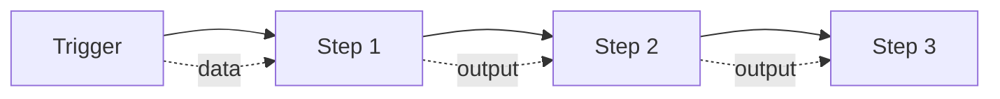

Workflows in Twenty automate business processes by triggering actions in response to events. Build powerful automations without writing code, or use custom JavaScript for complex logic.

## What are workflows?

A workflow consists of three components:

1. **Trigger**: The event that starts the workflow
2. **Steps**: The actions and logic to execute
3. **Variables**: Data passed between trigger and steps



## Workflow triggers

Triggers define when a workflow should run.

### Database event triggers

Run workflows when records are created, updated, deleted, or upserted.

<CodeGroup>
```typescript Company Created
{
  type: "DATABASE_EVENT",
  eventName: "company.created",
  // Access the new company via {{trigger.object}}
}
```

```typescript Person Updated
{
  type: "DATABASE_EVENT",
  eventName: "person.updated",
  // Access old and new values
}
```

```typescript Opportunity Deleted
{
  type: "DATABASE_EVENT",
  eventName: "opportunity.deleted",
  // Cleanup related records
}
```
</CodeGroup>

**Event format**: `objectName.action`
- Actions: `created`, `updated`, `deleted`, `upserted`
- Use lowercase object names: `company`, `person`, `task`

<Info>
  The triggered record is available in workflow steps via `{{trigger.object.fieldName}}`. For example: `{{trigger.object.name}}`, `{{trigger.object.annualRevenue}}`.
</Info>

### Manual triggers

Launch workflows on-demand from the UI.

<Tabs>
  <Tab title="Global">
    Available everywhere in the workspace.
    
    ```typescript
    {
      type: "MANUAL",
      availability: {
        type: "GLOBAL",
        locations: ["command-menu", "sidebar"]
      }
    }
    ```
  </Tab>
  
  <Tab title="Single Record">
    Launch from a specific record's detail page.
    
    ```typescript
    {
      type: "MANUAL",
      availability: {
        type: "SINGLE_RECORD",
        objectNameSingular: "company"
      }
      // Access via {{trigger.record.fieldName}}
    }
    ```
  </Tab>
  
  <Tab title="Bulk Records">
    Launch on multiple selected records.
    
    ```typescript
    {
      type: "MANUAL",
      availability: {
        type: "BULK_RECORDS",
        objectNameSingular: "person"
      }
      // Access via {{trigger.records}}
    }
    ```
  </Tab>
</Tabs>

### Scheduled triggers (Cron)

Run workflows on a recurring schedule.

```typescript Cron Examples
// Every day at 9 AM
"0 9 * * *"

// Every Monday at 8 AM
"0 8 * * 1"

// First day of month at midnight
"0 0 1 * *"

// Every hour
"0 * * * *"

// Every 15 minutes
"*/15 * * * *"
```

<Tip>
  Use [crontab.guru](https://crontab.guru) to build and validate cron expressions.
</Tip>

### Webhook triggers

Start workflows from external systems via HTTP POST.

```bash Webhook URL
POST https://your-twenty-instance.com/webhooks/workflows/{workflow-id}

Headers:
  Authorization: Bearer YOUR_API_KEY
  Content-Type: application/json

Body:
{
  "customData": "value",
  "anotherField": 123
}
```

Webhook payload is available as `{{trigger.payload}}`.

## Workflow actions

Actions are the steps that execute in your workflow.

### Record operations

#### Create record

Create a new record in any object.

```typescript Create Task
{
  action: "CREATE_RECORD",
  objectName: "task",
  fields: {
    title: "Follow up with {{trigger.object.name}}",
    dueDate: "{{trigger.object.closeDate}}",
    assignedTo: "{{trigger.object.ownerId}}",
    status: "TODO"
  }
}
```

#### Update record

Modify an existing record.

```typescript Update Company
{
  action: "UPDATE_RECORD",
  objectName: "company",
  recordId: "{{trigger.object.companyId}}",
  fields: {
    lastContactDate: "{{now}}",
    status: "CONTACTED"
  }
}
```

#### Find records

Query records with filters.

```typescript Find Open Opportunities
{
  action: "FIND_RECORDS",
  objectName: "opportunity",
  filters: {
    companyId: { eq: "{{trigger.object.id}}" },
    stage: { ne: "CLOSED_WON" }
  },
  limit: 10
}
// Access results via {{step.output.records}}
```

#### Delete record

Soft-delete or permanently remove a record.

```typescript Delete Record
{
  action: "DELETE_RECORD",
  objectName: "task",
  recordId: "{{step1.output.recordId}}",
  permanent: false  // true for hard delete
}
```

### Email actions

#### Send email

Send emails through connected email providers.

```typescript Send Email
{
  action: "SEND_EMAIL",
  to: ["{{trigger.object.email}}"],
  cc: ["sales@company.com"],
  subject: "Welcome to {{workspaceName}}",
  body: `
    Hi {{trigger.object.firstName}},
    
    Thank you for signing up. We're excited to work with you!
    
    Best regards,
    The Team
  `,
  attachments: ["{{step1.output.fileId}}"]
}
```

#### Draft email

Create a draft email for manual review before sending.

```typescript Draft Email
{
  action: "DRAFT_EMAIL",
  to: ["{{trigger.object.email}}"],
  subject: "Follow-up required",
  body: "Draft content...",
  relatedTo: {
    objectName: "person",
    recordId: "{{trigger.object.id}}"
  }
}
```

### HTTP request

Call external APIs.

<Tabs>
  <Tab title="GET Request">
    ```typescript
    {
      action: "HTTP_REQUEST",
      method: "GET",
      url: "https://api.example.com/users/{{trigger.object.email}}",
      headers: {
        "Authorization": "Bearer {{env.API_TOKEN}}",
        "Content-Type": "application/json"
      }
    }
    // Access via {{step.output.body}}
    ```
  </Tab>
  
  <Tab title="POST Request">
    ```typescript
    {
      action: "HTTP_REQUEST",
      method: "POST",
      url: "https://api.slack.com/api/chat.postMessage",
      headers: {
        "Authorization": "Bearer {{env.SLACK_TOKEN}}"
      },
      body: {
        channel: "#sales",
        text: "New opportunity: {{trigger.object.name}} - ${{trigger.object.amount}}"
      }
    }
    ```
  </Tab>
</Tabs>

### Conditional logic

#### If/Else branches

Execute different actions based on conditions.

```typescript If/Else Example
{
  action: "IF_ELSE",
  condition: {
    field: "{{trigger.object.amount}}",
    operator: "greaterThan",
    value: 50000
  },
  ifTrue: [
    // Actions for large deals
    {
      action: "SEND_EMAIL",
      to: ["vp-sales@company.com"],
      subject: "Large opportunity alert"
    }
  ],
  ifFalse: [
    // Actions for regular deals
    {
      action: "CREATE_RECORD",
      objectName: "task",
      fields: { title: "Follow up" }
    }
  ]
}
```

#### Filter action

Stop workflow execution if conditions aren't met.

```typescript Stop if Low Priority
{
  action: "FILTER",
  conditions: {
    logicalOperator: "AND",
    filters: [
      { field: "{{trigger.object.priority}}", operator: "in", value: ["HIGH", "URGENT"] },
      { field: "{{trigger.object.status}}", operator: "ne", value: "COMPLETED" }
    ]
  }
}
// Workflow stops here if conditions not met
```

### Custom code

Write JavaScript for complex logic.

```typescript Code Action
{
  action: "CODE",
  code: `
    // Access workflow variables
    const company = trigger.object;
    const revenue = company.annualRevenue;
    
    // Complex calculations
    let category;
    if (revenue > 10000000) {
      category = "Enterprise";
    } else if (revenue > 1000000) {
      category = "Mid-Market";
    } else {
      category = "SMB";
    }
    
    // Return data for next steps
    return {
      category: category,
      score: revenue / 1000000,
      isHighValue: revenue > 5000000
    };
  `
}
// Access via {{step.output.category}}, {{step.output.score}}
```

<Warning>
  Custom code runs in a sandboxed environment. You cannot import external packages or access the filesystem.
</Warning>

### AI agent actions

Use AI to process data and make decisions.

```typescript AI Analysis
{
  action: "AI_AGENT",
  agent: "default-agent",
  prompt: `
    Analyze this company and suggest next steps:
    
    Company: {{trigger.object.name}}
    Industry: {{trigger.object.industry}}
    Revenue: ${{trigger.object.annualRevenue}}
    
    Provide:
    1. Company profile summary
    2. Recommended sales approach
    3. Suggested follow-up timeline
  `,
  outputSchema: {
    summary: "string",
    approach: "string",
    followUpDays: "number"
  }
}
```

### Iterator (Loop)

Execute actions for each item in an array.

```typescript Iterate Over Records
{
  action: "ITERATOR",
  items: "{{step1.output.records}}",
  actions: [
    {
      action: "SEND_EMAIL",
      to: ["{{item.email}}"],
      subject: "Batch notification",
      body: "Hi {{item.firstName}}..."
    },
    {
      action: "UPDATE_RECORD",
      objectName: "person",
      recordId: "{{item.id}}",
      fields: { lastNotified: "{{now}}" }
    }
  ]
}
```

### Delay

Wait before executing next steps.

```typescript Delay
{
  action: "DELAY",
  duration: 86400,  // seconds (24 hours)
  unit: "SECONDS"   // or "MINUTES", "HOURS", "DAYS"
}
```

## Variables and expressions

Reference data throughout your workflow using variables.

### Variable syntax

Use double curly braces: `{{variableName}}`

```typescript Variable Examples
// Trigger data
{{trigger.object.name}}
{{trigger.object.email}}
{{trigger.record.id}}

// Previous step outputs
{{step1.output.recordId}}
{{findRecords.output.records[0].name}}

// Environment variables
{{env.API_KEY}}
{{env.SLACK_WEBHOOK_URL}}

// System variables
{{workspaceName}}
{{currentUser.email}}
{{now}}  // Current timestamp
```

### Accessing nested data

```typescript Nested Properties
// Object fields
{{trigger.object.address.city}}
{{trigger.object.owner.email}}

// Array items
{{step1.output.records[0].name}}
{{trigger.object.emails[0].email}}

// Composite fields
{{trigger.object.fullName.firstName}}
{{trigger.object.currency.amountMicros}}
```

### Functions and operators

```typescript Built-in Functions
// String operations
{{trigger.object.name.toUpperCase()}}
{{trigger.object.email.split('@')[0]}}

// Math operations
{{trigger.object.amount * 1.1}}  // Add 10%
{{trigger.object.price / 100}}   // Convert cents to dollars

// Date operations
{{trigger.object.createdAt | date('YYYY-MM-DD')}}
{{now | addDays(7)}}  // 7 days from now
```

<Tip>
  Test variables in the workflow builder's test mode to verify data is accessible correctly.
</Tip>

## Building a workflow

<Steps>
  <Step title="Navigate to Workflows">
    Go to Settings → Workflows or use the workflows section in the sidebar.
  </Step>
  
  <Step title="Create new workflow">
    Click "New Workflow" and provide:
    - **Name**: Descriptive workflow name
    - **Description**: What the workflow does
    - **Status**: Active or Inactive
  </Step>
  
  <Step title="Configure trigger">
    Choose trigger type and configure settings:
    - Database event: Select object and action
    - Manual: Set availability and locations
    - Cron: Enter schedule expression
    - Webhook: Copy webhook URL for external use
  </Step>
  
  <Step title="Add steps">
    Click "+" to add action steps:
    1. Choose action type
    2. Configure action settings
    3. Use variables to reference previous data
    4. Test each step individually
  </Step>
  
  <Step title="Test workflow">
    Use test mode to run workflow with sample data:
    - View execution logs
    - Check variable values at each step
    - Debug any errors
  </Step>
  
  <Step title="Activate workflow">
    Once tested, set status to "Active" to enable the workflow.
  </Step>
</Steps>

## Example workflows

### Lead nurturing sequence

```typescript Workflow: New Lead Follow-up
Trigger: person.created

Step 1: Send welcome email
  action: SEND_EMAIL
  to: {{trigger.object.email}}
  subject: "Welcome to {{workspaceName}}"

Step 2: Wait 3 days
  action: DELAY
  duration: 259200  // 3 days in seconds

Step 3: Check if engaged
  action: FIND_RECORDS
  objectName: "activity"
  filters: { personId: {{trigger.object.id}} }

Step 4: If no engagement, send follow-up
  action: IF_ELSE
  condition: {{step3.output.count}} == 0
  ifTrue:
    - SEND_EMAIL: "Are you still interested?"
  ifFalse:
    - CREATE_RECORD: Create task for sales rep
```

### Deal stage automation

```typescript Workflow: Opportunity Stage Change
Trigger: opportunity.updated

Step 1: Filter for stage changes
  action: FILTER
  condition: {{trigger.object.stage}} == "CLOSED_WON"

Step 2: Create onboarding tasks
  action: CREATE_RECORD
  objectName: "task"
  fields:
    title: "Send contract to {{trigger.object.companyName}}"
    assignedTo: {{trigger.object.ownerId}}
    dueDate: {{now | addDays(1)}}

Step 3: Notify team
  action: HTTP_REQUEST
  method: POST
  url: {{env.SLACK_WEBHOOK}}
  body:
    text: "🎉 Deal closed: {{trigger.object.name}} - ${{trigger.object.amount}}"

Step 4: Update company status
  action: UPDATE_RECORD
  objectName: "company"
  recordId: {{trigger.object.companyId}}
  fields:
    status: "CUSTOMER"
    lastPurchaseDate: {{now}}
```

### Data enrichment

```typescript Workflow: Enrich New Company
Trigger: company.created

Step 1: Check if website exists
  action: FILTER
  condition: {{trigger.object.website}} is not empty

Step 2: Call enrichment API
  action: HTTP_REQUEST
  method: GET
  url: "https://api.clearbit.com/v2/companies/find?domain={{trigger.object.website}}"
  headers:
    Authorization: "Bearer {{env.CLEARBIT_API_KEY}}"

Step 3: Update company with enriched data
  action: UPDATE_RECORD
  objectName: "company"
  recordId: {{trigger.object.id}}
  fields:
    industry: {{step2.output.body.category.industry}}
    employeeCount: {{step2.output.body.metrics.employees}}
    annualRevenue: {{step2.output.body.metrics.estimatedAnnualRevenue}}
    description: {{step2.output.body.description}}
```

## Best practices

### Performance

- **Limit API calls**: Cache results when possible
- **Use filters early**: Stop execution if conditions aren't met
- **Batch operations**: Use iterators instead of multiple workflows
- **Avoid deep nesting**: Keep workflows under 20 steps

### Error handling

<Tip>
  Add error notification steps to alert you when workflows fail.
</Tip>

- Test workflows thoroughly before activating
- Use try/catch patterns in custom code
- Add fallback branches in if/else logic
- Monitor workflow execution logs regularly

### Security

- Store API keys in environment variables, never hardcode
- Use workspace-level secrets for sensitive credentials
- Limit workflow permissions to necessary objects
- Review workflow logs for suspicious activity

### Maintenance

- Document complex workflows with descriptions
- Use descriptive step names
- Version workflows before major changes
- Deactivate unused workflows
- Review and optimize slow-running workflows

## Workflow limits

<Warning>
  Be aware of rate limits and resource constraints:
  
  - Maximum 100 steps per workflow
  - API rate limits apply to HTTP requests
  - Email sending is subject to provider limits
  - Workflows timeout after 5 minutes
</Warning>

## Next steps

<CardGroup cols={2}>
  <Card title="Objects and fields" icon="database" href="/core-concepts/objects-and-fields">
    Understand the data workflows operate on
  </Card>
  <Card title="Views and filters" icon="filter" href="/core-concepts/views-and-filters">
    Create filtered views to identify records for workflows
  </Card>
  <Card title="API Reference" icon="code" href="/developers/api/graphql-api">
    Trigger workflows programmatically via API
  </Card>
  <Card title="Webhook Integration" icon="webhook" href="/developers/extending/webhooks">
    Connect external systems to trigger workflows
  </Card>
</CardGroup>
