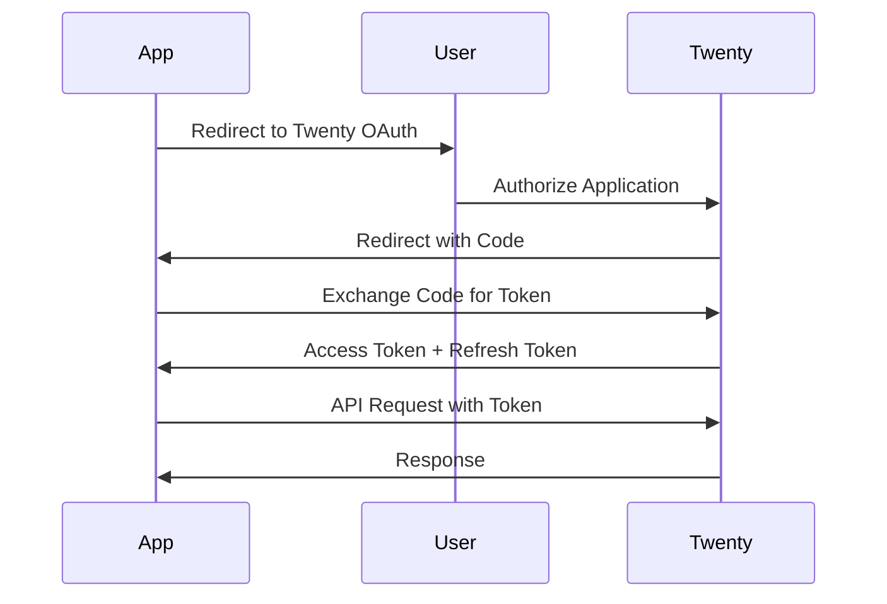

Secure your API requests with Twenty's authentication system supporting API keys, OAuth tokens, and JWT.

## Authentication Methods

Twenty supports multiple authentication methods:

<CardGroup cols={2}>
  <Card title="API Keys" icon="key">
    Best for server-to-server integrations and scripts
  </Card>
  <Card title="OAuth Tokens" icon="lock">
    For user-authorized third-party applications
  </Card>
  <Card title="JWT Tokens" icon="id-card">
    Session-based authentication for web applications
  </Card>
  <Card title="Personal Access Tokens" icon="user-lock">
    Long-lived tokens for personal use
  </Card>
</CardGroup>

## API Keys

API keys provide programmatic access to your workspace.

### Creating API Keys

1. Navigate to **Settings** → **API & Webhooks**
2. Click **Create API Key**
3. Give it a descriptive name
4. Copy the key immediately (it's only shown once)

<Warning>
  API keys grant full access to your workspace. Store them securely and never commit them to version control.
</Warning>

### Using API Keys

Include the API key in the `Authorization` header:

<CodeGroup>
```bash cURL
curl https://api.twenty.com/graphql \
  -H "Authorization: Bearer YOUR_API_KEY" \
  -H "Content-Type: application/json" \
  -d '{"query": "{ people { edges { node { id firstName } } } }"}'
```

```javascript JavaScript
const response = await fetch('https://api.twenty.com/graphql', {
  method: 'POST',
  headers: {
    'Authorization': 'Bearer YOUR_API_KEY',
    'Content-Type': 'application/json',
  },
  body: JSON.stringify({
    query: '{ people { edges { node { id firstName } } } }',
  }),
});

const data = await response.json();
```

```python Python
import requests

headers = {
    "Authorization": "Bearer YOUR_API_KEY",
    "Content-Type": "application/json",
}

response = requests.post(
    "https://api.twenty.com/graphql",
    headers=headers,
    json={"query": "{ people { edges { node { id firstName } } } }"}
)

data = response.json()
```
</CodeGroup>

### API Key Best Practices

<CardGroup cols={2}>
  <Card title="Environment Variables" icon="gear">
    Store API keys in environment variables, never hardcode
  </Card>
  <Card title="Separate Keys" icon="copy">
    Use different keys for development, staging, and production
  </Card>
  <Card title="Rotate Regularly" icon="arrows-rotate">
    Rotate keys periodically and when team members leave
  </Card>
  <Card title="Least Privilege" icon="user-shield">
    Use workspace permissions to limit API key access
  </Card>
</CardGroup>

### Revoking API Keys

1. Go to **Settings** → **API & Webhooks**
2. Find the key to revoke
3. Click **Delete**
4. Confirm deletion

<Note>
  Revoking an API key immediately invalidates it. Any applications using that key will receive 401 errors.
</Note>

## OAuth Authentication

For applications that act on behalf of users.

### OAuth Flow



### Step 1: Authorization Request

Redirect user to Twenty's authorization endpoint:

```
https://api.twenty.com/auth/authorize?
  client_id=YOUR_CLIENT_ID&
  redirect_uri=https://your-app.com/callback&
  response_type=code&
  scope=read:people write:people
```

<ParamField path="client_id" type="string" required>
  Your OAuth application's client ID
</ParamField>

<ParamField path="redirect_uri" type="string" required>
  URL to redirect to after authorization
</ParamField>

<ParamField path="response_type" type="string" required>
  Must be `code` for authorization code flow
</ParamField>

<ParamField path="scope" type="string">
  Space-separated list of permissions requested
</ParamField>

<ParamField path="state" type="string">
  Optional state parameter for CSRF protection
</ParamField>

### Step 2: Handle Callback

Twenty redirects to your callback URL with an authorization code:

```
https://your-app.com/callback?code=AUTH_CODE&state=STATE_VALUE
```

### Step 3: Exchange Code for Token

```bash
curl -X POST https://api.twenty.com/auth/token \
  -H "Content-Type: application/json" \
  -d '{
    "grant_type": "authorization_code",
    "code": "AUTH_CODE",
    "client_id": "YOUR_CLIENT_ID",
    "client_secret": "YOUR_CLIENT_SECRET",
    "redirect_uri": "https://your-app.com/callback"
  }'
```

**Response:**

```json
{
  "access_token": "eyJhbGciOiJIUzI1NiIsInR5cCI6IkpXVCJ9...",
  "refresh_token": "eyJhbGciOiJIUzI1NiIsInR5cCI6IkpXVCJ9...",
  "token_type": "Bearer",
  "expires_in": 1800
}
```

### Step 4: Use Access Token

```bash
curl https://api.twenty.com/graphql \
  -H "Authorization: Bearer ACCESS_TOKEN" \
  -H "Content-Type: application/json" \
  -d '{"query": "{ people { edges { node { id firstName } } } }"}'
```

### Refresh Tokens

Access tokens expire after 30 minutes. Use refresh token to get new access token:

```bash
curl -X POST https://api.twenty.com/auth/token \
  -H "Content-Type: application/json" \
  -d '{
    "grant_type": "refresh_token",
    "refresh_token": "REFRESH_TOKEN",
    "client_id": "YOUR_CLIENT_ID",
    "client_secret": "YOUR_CLIENT_SECRET"
  }'
```

## JWT Tokens

For web application sessions.

### Login with Credentials

```bash
curl -X POST https://api.twenty.com/auth/login \
  -H "Content-Type: application/json" \
  -d '{
    "email": "user@example.com",
    "password": "password"
  }'
```

**Response:**

```json
{
  "accessToken": "eyJhbGciOiJIUzI1NiIsInR5cCI6IkpXVCJ9...",
  "refreshToken": "eyJhbGciOiJIUzI1NiIsInR5cCI6IkpXVCJ9...",
  "user": {
    "id": "user-id",
    "email": "user@example.com",
    "firstName": "John",
    "lastName": "Doe"
  }
}
```

### JWT Structure

Twenty JWTs contain:

```json
{
  "sub": "user-id",
  "workspaceId": "workspace-id",
  "email": "user@example.com",
  "iat": 1709546400,
  "exp": 1709548200
}
```

## Token Expiration

Default token lifetimes:

- **Access Token** - 30 minutes
- **Refresh Token** - 90 days
- **Login Token** - 15 minutes
- **File Token** - 1 day
- **Password Reset Token** - 5 minutes

Configure via environment variables:

```bash
ACCESS_TOKEN_EXPIRES_IN=30m
REFRESH_TOKEN_EXPIRES_IN=90d
LOGIN_TOKEN_EXPIRES_IN=15m
FILE_TOKEN_EXPIRES_IN=1d
PASSWORD_RESET_TOKEN_EXPIRES_IN=5m
```

## Permissions

### Workspace Roles

API access is controlled by workspace roles:

- **Admin** - Full access to all data and settings
- **Member** - Access to assigned records
- **Custom Roles** - Granular permission control

### Permission Flags

API keys inherit permissions from the workspace:

- `READ` - Read access to objects
- `WRITE` - Create and update records
- `DELETE` - Delete records
- `API_KEYS_AND_WEBHOOKS` - Manage API keys and webhooks

### Check Permissions

```graphql
query GetCurrentUser {
  currentUser {
    id
    email
    role
    permissions {
      object
      actions
    }
  }
}
```

## Rate Limiting

### Default Limits

- **100 requests per minute** per API key
- **Shared** across GraphQL and REST APIs
- **Per workspace** rate limits

### Configure Rate Limits

Adjust via environment variables:

```bash
API_RATE_LIMITING_TTL=60000        # Window in milliseconds
API_RATE_LIMITING_LIMIT=100         # Requests per window
```

### Rate Limit Headers

Every response includes rate limit information:

```
X-RateLimit-Limit: 100
X-RateLimit-Remaining: 87
X-RateLimit-Reset: 1709546460
```

### Handle 429 Errors

```javascript
async function makeRequestWithRateLimit(fn) {
  try {
    return await fn();
  } catch (error) {
    if (error.response?.status === 429) {
      const resetTime = error.response.headers['x-ratelimit-reset'];
      const waitTime = (resetTime * 1000) - Date.now() + 1000; // +1s buffer
      
      console.log(`Rate limited. Waiting ${waitTime}ms`);
      await new Promise(resolve => setTimeout(resolve, waitTime));
      
      return await fn(); // Retry
    }
    throw error;
  }
}
```

## Security Best Practices

<Steps>
  <Step title="Use HTTPS Only">
    Always use HTTPS in production to encrypt API keys in transit
  </Step>
  
  <Step title="Store Secrets Securely">
    Use environment variables or secret managers, never hardcode
  </Step>
  
  <Step title="Rotate Keys Regularly">
    Change API keys periodically and when team members leave
  </Step>
  
  <Step title="Monitor Usage">
    Track API usage to detect unauthorized access
  </Step>
  
  <Step title="Principle of Least Privilege">
    Grant minimum permissions necessary
  </Step>
</Steps>

### Secure Storage

<CodeGroup>
```javascript Node.js
// Use environment variables
const apiKey = process.env.TWENTY_API_KEY;

// Or use dotenv
require('dotenv').config();
const apiKey = process.env.TWENTY_API_KEY;
```

```python Python
import os
from dotenv import load_dotenv

load_dotenv()
api_key = os.environ["TWENTY_API_KEY"]
```

```bash Environment
# .env file
TWENTY_API_KEY=your-api-key-here

# Add to .gitignore
echo ".env" >> .gitignore
```
</CodeGroup>

### Secret Managers

<CodeGroup>
```javascript AWS Secrets Manager
const AWS = require('aws-sdk');
const secretsManager = new AWS.SecretsManager();

async function getApiKey() {
  const secret = await secretsManager.getSecretValue({
    SecretId: 'twenty-api-key',
  }).promise();
  
  return JSON.parse(secret.SecretString).apiKey;
}
```

```javascript HashiCorp Vault
const vault = require('node-vault')({
  endpoint: 'https://vault.yourcompany.com',
  token: process.env.VAULT_TOKEN,
});

async function getApiKey() {
  const secret = await vault.read('secret/data/twenty');
  return secret.data.data.apiKey;
}
```

```javascript Azure Key Vault
const { SecretClient } = require('@azure/keyvault-secrets');
const { DefaultAzureCredential } = require('@azure/identity');

const client = new SecretClient(
  'https://your-vault.vault.azure.net',
  new DefaultAzureCredential()
);

async function getApiKey() {
  const secret = await client.getSecret('twenty-api-key');
  return secret.value;
}
```
</CodeGroup>

## OAuth Implementation

Build OAuth-based integrations:

### Complete OAuth Example

```javascript
const express = require('express');
const session = require('express-session');
const axios = require('axios');

const app = express();

app.use(session({
  secret: 'your-session-secret',
  resave: false,
  saveUninitialized: false,
}));

const TWENTY_AUTH_URL = 'https://api.twenty.com/auth/authorize';
const TWENTY_TOKEN_URL = 'https://api.twenty.com/auth/token';
const CLIENT_ID = process.env.TWENTY_CLIENT_ID;
const CLIENT_SECRET = process.env.TWENTY_CLIENT_SECRET;
const REDIRECT_URI = 'https://your-app.com/callback';

// Step 1: Redirect to Twenty
app.get('/connect', (req, res) => {
  const state = generateRandomString();
  req.session.oauthState = state;
  
  const authUrl = `${TWENTY_AUTH_URL}?${
    new URLSearchParams({
      client_id: CLIENT_ID,
      redirect_uri: REDIRECT_URI,
      response_type: 'code',
      scope: 'read:people write:people',
      state,
    })
  }`;
  
  res.redirect(authUrl);
});

// Step 2: Handle callback
app.get('/callback', async (req, res) => {
  const { code, state } = req.query;
  
  // Verify state
  if (state !== req.session.oauthState) {
    return res.status(403).send('Invalid state');
  }
  
  try {
    // Exchange code for tokens
    const response = await axios.post(TWENTY_TOKEN_URL, {
      grant_type: 'authorization_code',
      code,
      client_id: CLIENT_ID,
      client_secret: CLIENT_SECRET,
      redirect_uri: REDIRECT_URI,
    });
    
    const { access_token, refresh_token } = response.data;
    
    // Store tokens securely
    req.session.accessToken = access_token;
    req.session.refreshToken = refresh_token;
    
    res.send('Connected successfully!');
  } catch (error) {
    console.error('OAuth error:', error);
    res.status(500).send('Authentication failed');
  }
});

// Use access token
app.get('/people', async (req, res) => {
  const accessToken = req.session.accessToken;
  
  if (!accessToken) {
    return res.redirect('/connect');
  }
  
  try {
    const response = await axios.post(
      'https://api.twenty.com/graphql',
      {
        query: '{ people { edges { node { id firstName } } } }',
      },
      {
        headers: {
          'Authorization': `Bearer ${accessToken}`,
        },
      }
    );
    
    res.json(response.data);
  } catch (error) {
    if (error.response?.status === 401) {
      // Token expired, try refresh
      return res.redirect('/refresh');
    }
    throw error;
  }
});

function generateRandomString() {
  return Math.random().toString(36).substring(7);
}
```

## JWT Validation

For custom authentication flows:

### Verify JWT Token

```javascript
const jwt = require('jsonwebtoken');

function verifyToken(token, appSecret) {
  try {
    const decoded = jwt.verify(token, appSecret);
    return {
      valid: true,
      userId: decoded.sub,
      workspaceId: decoded.workspaceId,
    };
  } catch (error) {
    if (error.name === 'TokenExpiredError') {
      return { valid: false, reason: 'expired' };
    }
    return { valid: false, reason: 'invalid' };
  }
}
```

### Middleware Example

```javascript
function authenticateJWT(req, res, next) {
  const authHeader = req.headers.authorization;
  
  if (!authHeader || !authHeader.startsWith('Bearer ')) {
    return res.status(401).json({ error: 'Missing authorization header' });
  }
  
  const token = authHeader.substring(7);
  const result = verifyToken(token, process.env.APP_SECRET);
  
  if (!result.valid) {
    return res.status(401).json({ error: `Invalid token: ${result.reason}` });
  }
  
  req.userId = result.userId;
  req.workspaceId = result.workspaceId;
  next();
}

app.use('/api', authenticateJWT);
```

## Multi-Workspace Authentication

For applications supporting multiple workspaces:

```javascript
class TwentyClient {
  constructor() {
    this.workspaces = new Map();
  }
  
  // Add workspace credentials
  addWorkspace(workspaceId, apiKey) {
    this.workspaces.set(workspaceId, {
      apiKey,
      client: axios.create({
        baseURL: 'https://api.twenty.com',
        headers: {
          'Authorization': `Bearer ${apiKey}`,
        },
      }),
    });
  }
  
  // Get client for workspace
  getClient(workspaceId) {
    const workspace = this.workspaces.get(workspaceId);
    if (!workspace) {
      throw new Error(`Workspace ${workspaceId} not configured`);
    }
    return workspace.client;
  }
  
  // Make request to specific workspace
  async query(workspaceId, query, variables) {
    const client = this.getClient(workspaceId);
    const response = await client.post('/graphql', {
      query,
      variables,
    });
    return response.data;
  }
}

// Usage
const twentyClient = new TwentyClient();
twentyClient.addWorkspace('workspace-1', 'api-key-1');
twentyClient.addWorkspace('workspace-2', 'api-key-2');

const people1 = await twentyClient.query('workspace-1', PEOPLE_QUERY);
const people2 = await twentyClient.query('workspace-2', PEOPLE_QUERY);
```

## Troubleshooting

<AccordionGroup>
  <Accordion title="401 Unauthorized">
    **Causes:**
    - API key is invalid or revoked
    - API key not in Authorization header
    - Token expired
    
    **Solutions:**
    - Verify API key is correct
    - Check header format: `Authorization: Bearer KEY`
    - Refresh token if expired
    - Generate new API key if needed
  </Accordion>

  <Accordion title="403 Forbidden">
    **Causes:**
    - Insufficient permissions
    - Workspace role doesn't allow operation
    - Custom permissions not granted
    
    **Solutions:**
    - Check user role in workspace settings
    - Request admin to grant permissions
    - Verify API key has required permissions
  </Accordion>

  <Accordion title="Token expires too quickly">
    **Solutions:**
    - Implement token refresh logic
    - Use refresh tokens to get new access tokens
    - Increase token lifetime in server config (if self-hosting)
  </Accordion>

  <Accordion title="CORS errors in browser">
    **Cause:**
    CORS policy prevents browser requests
    
    **Solution:**
    Make API requests from your backend, not browser:
    ```
    Browser -> Your Backend -> Twenty API
    ```
    This also keeps API keys secure.
  </Accordion>
</AccordionGroup>

## Testing Authentication

### Test API Key

```bash
# Simple test query
curl https://api.twenty.com/graphql \
  -H "Authorization: Bearer YOUR_API_KEY" \
  -H "Content-Type: application/json" \
  -d '{"query": "{ __typename }"}'

# Should return: {"data": {"__typename": "Query"}}
```

### Test OAuth Flow

1. Navigate to `/connect` in your application
2. Authorize the application
3. Verify redirect to callback with code
4. Check tokens are received and stored
5. Make test API request

## Next Steps

<CardGroup cols={2}>
  <Card title="GraphQL API" icon="diagram-project" href="/developers/api/graphql-api">
    Learn the GraphQL API
  </Card>
  <Card title="REST API" icon="brackets-curly" href="/developers/api/rest-api">
    Use the REST API
  </Card>
  <Card title="JavaScript SDK" icon="js" href="/developers/api/sdk">
    SDK with built-in auth
  </Card>
  <Card title="Webhooks" icon="webhook" href="/developers/extending/webhooks">
    Secure webhook endpoints
  </Card>
</CardGroup>
