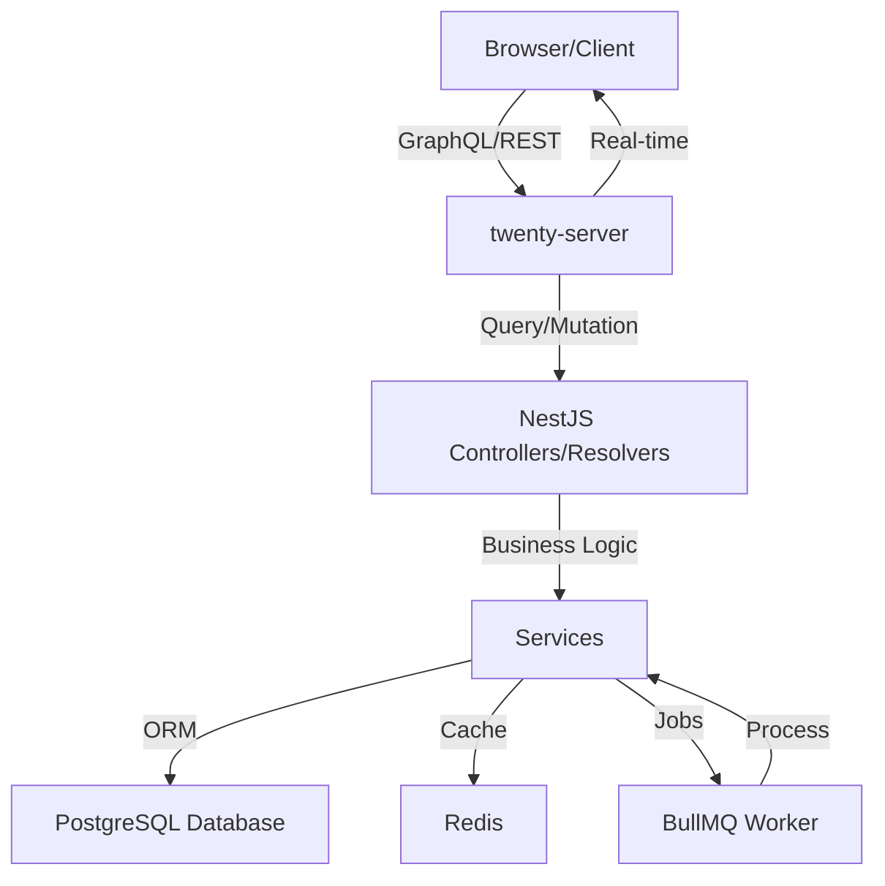

Twenty is built as a modern, scalable CRM platform using a monorepo architecture. This guide provides an overview of the technical stack and project structure.

## Tech Stack

Twenty uses cutting-edge technologies to deliver a performant and maintainable application:

### Frontend

- **React 18** - UI framework with concurrent features
- **TypeScript** - Type-safe JavaScript
- **Jotai** - Atomic state management
- **Linaria** - Zero-runtime CSS-in-JS
- **Vite** - Fast build tool and dev server
- **Lingui** - Internationalization (i18n)
- **Apollo Client** - GraphQL client

### Backend

- **NestJS** - Progressive Node.js framework
- **TypeORM** - Object-relational mapping for TypeScript
- **PostgreSQL** - Primary relational database
- **Redis** - Caching and session storage
- **GraphQL Yoga** - GraphQL server
- **BullMQ** - Background job processing

### Infrastructure

- **Nx** - Monorepo management and build system
- **Yarn 4** - Package manager with Plug'n'Play
- **Docker** - Containerization
- **TypeScript 5.9** - Throughout the entire stack

## Monorepo Structure

Twenty uses Nx to manage its monorepo workspace:

```
packages/
├── twenty-front/          # React frontend application
├── twenty-server/         # NestJS backend API
├── twenty-ui/             # Shared UI components library
├── twenty-shared/         # Common types and utilities
├── twenty-emails/         # Email templates with React Email
├── twenty-website/        # Next.js documentation website
├── twenty-zapier/         # Zapier integration
├── twenty-sdk/            # SDK for building applications
├── twenty-apps/           # Application marketplace
├── twenty-cli/            # CLI tool for developers
├── twenty-e2e-testing/    # Playwright E2E tests
├── twenty-docker/         # Docker configurations
└── twenty-eslint-rules/   # Custom ESLint rules
```

<Note>
  The `twenty-shared` package must be built first as other packages depend on it:
  ```bash
  npx nx build twenty-shared
  ```
</Note>

## Package Details

### twenty-front

The React frontend application providing the CRM user interface.

**Key Features:**
- Table and Kanban views for records
- Real-time updates via GraphQL subscriptions
- Drag-and-drop interface
- Custom field configuration
- Workflow builder UI

**Architecture:**
- Component-based architecture
- Atomic state management with Jotai
- GraphQL queries and mutations
- Styled with Linaria CSS-in-JS

### twenty-server

The NestJS backend providing APIs and business logic.

**Key Features:**
- GraphQL API (primary)
- REST API (for simple integrations)
- Authentication and authorization
- Metadata management
- Webhook system
- Background job processing

**Architecture:**
- Modular NestJS structure
- TypeORM entities and repositories
- GraphQL code-first approach
- Redis-backed caching
- BullMQ job queues

### twenty-ui

Shared component library used across frontend applications.

**Includes:**
- Buttons, inputs, and form controls
- Data tables and lists
- Modal dialogs
- Layout components
- Icons from Tabler Icons

### twenty-shared

Common utilities, types, and constants shared across packages.

**Includes:**
- TypeScript type definitions
- Validation helpers (`isDefined`, `isNonEmptyString`)
- Constants and enums
- Utility functions

### twenty-sdk

SDK for building custom applications and integrations.

**Features:**
- TypeScript SDK with type safety
- Auto-generated GraphQL clients
- CLI for development workflow
- Function and component scaffolding

### twenty-apps

Marketplace applications extending Twenty's functionality.

**Examples:**
- Meeting transcripts
- LinkedIn integration
- Activity summaries
- Custom workflows

## Data Flow

Understanding how data flows through Twenty:



### Request Flow

1. **Client Request** - Frontend sends GraphQL query/mutation
2. **Authentication** - JWT token validated by guards
3. **Authorization** - Permissions checked against user role
4. **Resolver/Controller** - Request handled by appropriate handler
5. **Service Layer** - Business logic executed
6. **Data Access** - TypeORM queries PostgreSQL
7. **Response** - Data returned to client

### Background Jobs

Asynchronous tasks are processed via BullMQ:

- Email sending
- Webhook delivery
- Data imports/exports
- External API calls
- Scheduled tasks

## Database Architecture

### PostgreSQL

Primary data store with:
- **Core tables** - Users, workspaces, permissions
- **Metadata tables** - Object and field definitions
- **Workspace data** - Custom objects and records
- **Audit logs** - Change tracking

### Redis

Used for:
- Session storage
- Query result caching
- Job queue state
- Real-time pub/sub

### ClickHouse (Optional)

For analytics when enabled:
- Event tracking
- Usage analytics
- Performance metrics

## API Architecture

### GraphQL API

Primary API with code-first schema generation:

- **Core API** - Workspace data operations (CRUD)
- **Metadata API** - Schema configuration
- **Subscriptions** - Real-time updates
- **Batching** - Efficient data loading

### REST API

Simpler alternative for basic integrations:

- Standard HTTP methods (GET, POST, PATCH, DELETE)
- JSON request/response
- Same authentication as GraphQL
- Auto-generated from GraphQL schema

## Authentication & Authorization

### Authentication Methods

- **Password** - Email/password login
- **Google OAuth** - Google sign-in
- **Microsoft OAuth** - Microsoft sign-in
- **API Keys** - Programmatic access
- **JWT Tokens** - Stateless authentication

### Authorization Model

- **Role-based** - Admin, Member, custom roles
- **Permission flags** - Granular access control
- **Workspace isolation** - Multi-tenancy support

## Build System

Nx provides:

- **Incremental builds** - Only rebuild changed packages
- **Caching** - Local and remote build caching
- **Task orchestration** - Parallel execution
- **Dependency graph** - Visualize package relationships

```bash
# View dependency graph
npx nx graph

# Build with caching
npx nx build twenty-front

# Run task on all affected packages
npx nx affected --target=test
```

## Development Principles

<CardGroup cols={2}>
  <Card title="Functional Components" icon="function">
    Only functional components, no class components
  </Card>
  <Card title="Named Exports" icon="file-export">
    No default exports, always use named exports
  </Card>
  <Card title="Type Safety" icon="shield-check">
    Strict TypeScript, no `any` types allowed
  </Card>
  <Card title="Composition" icon="cubes">
    Prefer composition over inheritance
  </Card>
</CardGroup>

### Naming Conventions

- **Variables/functions** - `camelCase`
- **Types/Classes** - `PascalCase`
- **Constants** - `SCREAMING_SNAKE_CASE`
- **Files/directories** - `kebab-case`

### File Organization

- Components under 300 lines
- Services under 500 lines
- Components in their own directories
- Co-located tests and stories

## Performance Considerations

### Frontend Optimization

- Code splitting with React lazy loading
- Memoization with `useMemo` and `useCallback`
- Virtual scrolling for large lists
- Optimistic UI updates

### Backend Optimization

- Database query optimization
- Redis caching strategy
- Connection pooling
- Rate limiting

## Next Steps

<CardGroup cols={2}>
  <Card title="Local Setup" icon="laptop-code" href="/developers/local-setup">
    Set up your development environment
  </Card>
  <Card title="GraphQL API" icon="diagram-project" href="/developers/api/graphql-api">
    Learn about the GraphQL API
  </Card>
  <Card title="Building Apps" icon="puzzle-piece" href="/developers/extending/custom-apps">
    Create custom applications
  </Card>
  <Card title="Contributing" icon="code-pull-request" href="/developers/contributing/getting-started">
    Contribute to Twenty
  </Card>
</CardGroup>
