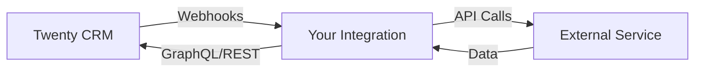

Build integrations that connect Twenty with external services and platforms to enhance your CRM workflow.

## Overview

Integrations allow you to:
- **Sync data** - Keep data in sync across platforms
- **Automate workflows** - Trigger actions across systems
- **Enrich data** - Enhance records with external data sources
- **Connect services** - Link Twenty with tools your team uses

## Integration Architecture



## Types of Integrations

### 1. Webhook-Based Integration

Listen to Twenty events and react in external systems:

```javascript
// Example: Slack notification integration
const express = require('express');
const { WebClient } = require('@slack/web-api');

const app = express();
const slack = new WebClient(process.env.SLACK_TOKEN);

app.post('/webhook/slack-notify', async (req, res) => {
  const { operation, record } = req.body;
  
  if (operation === 'opportunity.created') {
    await slack.chat.postMessage({
      channel: '#sales',
      text: `🎯 New opportunity: *${record.name}*`,
      blocks: [
        {
          type: 'section',
          text: {
            type: 'mrkdwn',
            text: `*${record.name}*\nAmount: $${record.amount}\nStage: ${record.stage}`,
          },
        },
        {
          type: 'actions',
          elements: [
            {
              type: 'button',
              text: { type: 'plain_text', text: 'View in Twenty' },
              url: `https://app.twenty.com/objects/opportunity/${record.id}`,
            },
          ],
        },
      ],
    });
  }
  
  res.sendStatus(200);
});
```

### 2. Bi-Directional Sync

Sync data both ways between Twenty and external service:

```javascript
const { CoreApiClient } = require('twenty-sdk');

const twentyClient = new CoreApiClient({
  apiKey: process.env.TWENTY_API_KEY,
  apiUrl: process.env.TWENTY_API_URL,
});

class HubSpotIntegration {
  constructor(hubspotApiKey, twentyClient) {
    this.hubspot = new HubSpotClient(hubspotApiKey);
    this.twenty = twentyClient;
  }
  
  // Sync contact from HubSpot to Twenty
  async syncContactToTwenty(hubspotContactId) {
    const contact = await this.hubspot.contacts.getById(hubspotContactId);
    
    const person = await this.twenty.createOne('person', {
      firstName: contact.properties.firstname,
      lastName: contact.properties.lastname,
      email: contact.properties.email,
      phone: contact.properties.phone,
      externalId: contact.id,
      source: 'hubspot',
    });
    
    return person;
  }
  
  // Sync contact from Twenty to HubSpot
  async syncContactToHubSpot(twentyPersonId) {
    const person = await this.twenty.findOne('person', twentyPersonId);
    
    const contact = await this.hubspot.contacts.create({
      properties: {
        firstname: person.firstName,
        lastname: person.lastName,
        email: person.email,
        phone: person.phone,
        twenty_id: person.id,
      },
    });
    
    // Store external ID
    await this.twenty.updateOne('person', twentyPersonId, {
      externalId: contact.id,
    });
    
    return contact;
  }
  
  // Handle webhook from Twenty
  async handleTwentyWebhook(payload) {
    const { operation, record } = payload;
    
    if (operation === 'person.created' && !record.externalId) {
      await this.syncContactToHubSpot(record.id);
    } else if (operation === 'person.updated' && record.externalId) {
      await this.hubspot.contacts.update(record.externalId, {
        properties: {
          firstname: record.firstName,
          lastname: record.lastName,
          email: record.email,
        },
      });
    }
  }
}
```

### 3. Data Enrichment

Enrich Twenty records with external data:

```javascript
const { CoreApiClient } = require('twenty-sdk');
const clearbit = require('clearbit')(process.env.CLEARBIT_API_KEY);

app.post('/webhook/enrich-company', async (req, res) => {
  const { operation, record } = req.body;
  
  if (operation === 'company.created' && record.website) {
    try {
      // Enrich company data from Clearbit
      const enrichedData = await clearbit.Company.find({
        domain: record.website,
      });
      
      // Update Twenty record
      await twentyClient.updateOne('company', record.id, {
        industry: enrichedData.category.industry,
        employeeCount: enrichedData.metrics.employees,
        annualRevenue: enrichedData.metrics.estimatedAnnualRevenue,
        description: enrichedData.description,
        logo: enrichedData.logo,
        linkedInUrl: enrichedData.linkedin.handle,
        twitterUrl: enrichedData.twitter.handle,
      });
      
      console.log('Enriched company:', record.name);
    } catch (error) {
      console.error('Enrichment failed:', error);
    }
  }
  
  res.sendStatus(200);
});
```

### 4. OAuth Integration

Build integrations requiring OAuth authentication:

```javascript
const express = require('express');
const { CoreApiClient } = require('twenty-sdk');
const { google } = require('googleapis');

class GoogleCalendarIntegration {
  constructor() {
    this.oauth2Client = new google.auth.OAuth2(
      process.env.GOOGLE_CLIENT_ID,
      process.env.GOOGLE_CLIENT_SECRET,
      process.env.GOOGLE_REDIRECT_URI
    );
  }
  
  // Step 1: Generate OAuth URL
  getAuthUrl(userId) {
    return this.oauth2Client.generateAuthUrl({
      access_type: 'offline',
      scope: ['https://www.googleapis.com/auth/calendar'],
      state: userId, // Pass user ID to link accounts
    });
  }
  
  // Step 2: Handle OAuth callback
  async handleCallback(code, userId) {
    const { tokens } = await this.oauth2Client.getToken(code);
    
    // Store tokens securely
    await db.integrations.upsert({
      userId,
      provider: 'google-calendar',
      accessToken: encrypt(tokens.access_token),
      refreshToken: encrypt(tokens.refresh_token),
    });
  }
  
  // Step 3: Sync events
  async syncEventsToTwenty(userId) {
    const integration = await db.integrations.findOne({ userId });
    
    this.oauth2Client.setCredentials({
      access_token: decrypt(integration.accessToken),
      refresh_token: decrypt(integration.refreshToken),
    });
    
    const calendar = google.calendar({ version: 'v3', auth: this.oauth2Client });
    const events = await calendar.events.list({
      calendarId: 'primary',
      timeMin: new Date().toISOString(),
      maxResults: 100,
    });
    
    // Create activities in Twenty
    for (const event of events.data.items) {
      await twentyClient.createOne('activity', {
        title: event.summary,
        type: 'MEETING',
        startDate: event.start.dateTime,
        endDate: event.end.dateTime,
        description: event.description,
        externalId: event.id,
      });
    }
  }
}
```

## Integration Patterns

### Polling Pattern

Periodically check for changes:

```javascript
class PollingIntegration {
  constructor(twentyClient, externalApi) {
    this.twenty = twentyClient;
    this.external = externalApi;
  }
  
  async poll() {
    // Get last sync time
    const lastSync = await this.getLastSyncTime();
    
    // Fetch changes from external service
    const changes = await this.external.getChangesSince(lastSync);
    
    // Apply changes to Twenty
    for (const change of changes) {
      if (change.type === 'contact') {
        await this.syncContact(change.data);
      }
    }
    
    // Update last sync time
    await this.saveLastSyncTime(new Date());
  }
  
  // Run every 5 minutes
  start() {
    setInterval(() => this.poll(), 5 * 60 * 1000);
  }
}
```

### Event-Driven Pattern

React immediately to changes using webhooks:

```javascript
class EventDrivenIntegration {
  // Handle Twenty webhook
  async handleTwentyEvent(payload) {
    const { operation, record } = payload;
    
    // Push to external service immediately
    if (operation.startsWith('person.')) {
      await this.syncToExternalService(record);
    }
  }
  
  // Handle external webhook
  async handleExternalEvent(payload) {
    const { event, data } = payload;
    
    // Update Twenty immediately
    if (event === 'contact.updated') {
      await this.syncToTwenty(data);
    }
  }
}
```

## Error Handling

### Retry Strategy

```javascript
const retry = async (fn, maxAttempts = 3, delay = 1000) => {
  for (let attempt = 1; attempt <= maxAttempts; attempt++) {
    try {
      return await fn();
    } catch (error) {
      if (attempt === maxAttempts) throw error;
      await new Promise(resolve => setTimeout(resolve, delay * attempt));
    }
  }
};

app.post('/webhook', async (req, res) => {
  try {
    await retry(async () => {
      await processWebhook(req.body);
    });
    res.sendStatus(200);
  } catch (error) {
    console.error('Failed after retries:', error);
    res.status(500).send('Processing failed');
  }
});
```

### Dead Letter Queue

```javascript
app.post('/webhook', async (req, res) => {
  try {
    await processWebhook(req.body);
    res.sendStatus(200);
  } catch (error) {
    // Store failed webhook for manual review
    await db.failedWebhooks.create({
      payload: req.body,
      error: error.message,
      timestamp: new Date(),
    });
    
    // Return 200 to prevent retries
    res.sendStatus(200);
  }
});
```

## Publishing to Marketplace

Share your integration with the Twenty community:

1. **Package your app** - Ensure all code is in `packages/twenty-apps/community/your-app`
2. **Add documentation** - Include README.md with setup instructions
3. **Test thoroughly** - Verify all features work
4. **Submit PR** - Open pull request to Twenty repository
5. **Review process** - Maintainers review and provide feedback

### Marketplace Requirements

- Clear documentation
- Error handling
- Security best practices
- MIT or AGPL-3.0 license
- Working example/demo

## Integration Examples

### Zapier Integration

Twenty has an official Zapier integration in `packages/twenty-zapier/`.

### Slack Bot

```javascript
const { App } = require('@slack/bolt');
const { CoreApiClient } = require('twenty-sdk');

const slackApp = new App({
  token: process.env.SLACK_BOT_TOKEN,
  signingSecret: process.env.SLACK_SIGNING_SECRET,
});

const twenty = new CoreApiClient({
  apiKey: process.env.TWENTY_API_KEY,
  apiUrl: process.env.TWENTY_API_URL,
});

// Slash command: /create-contact John Doe john@example.com
slackApp.command('/create-contact', async ({ command, ack, respond }) => {
  await ack();
  
  const [firstName, lastName, email] = command.text.split(' ');
  
  try {
    const person = await twenty.createOne('person', {
      firstName,
      lastName,
      email,
    });
    
    await respond(`Created contact: ${person.firstName} ${person.lastName}`);
  } catch (error) {
    await respond(`Error: ${error.message}`);
  }
});

slackApp.start(3000);
```

### Email Service Integration

```javascript
const sgMail = require('@sendgrid/mail');
sgMail.setApiKey(process.env.SENDGRID_API_KEY);

app.post('/webhook/send-welcome-email', async (req, res) => {
  const { operation, record } = req.body;
  
  if (operation === 'person.created' && record.email) {
    const msg = {
      to: record.email,
      from: 'welcome@yourcompany.com',
      subject: `Welcome ${record.firstName}!`,
      html: `
        <h1>Welcome to our CRM!</h1>
        <p>Hi ${record.firstName},</p>
        <p>We're excited to have you in our system.</p>
      `,
    };
    
    await sgMail.send(msg);
    
    // Log email sent in Twenty
    await twentyClient.createOne('activity', {
      type: 'EMAIL',
      title: 'Welcome email sent',
      person: { connect: record.id },
      completedAt: new Date(),
    });
  }
  
  res.sendStatus(200);
});
```

## OAuth Flow Implementation

### Complete OAuth Example

```javascript
const express = require('express');
const session = require('express-session');
const passport = require('passport');
const OAuth2Strategy = require('passport-oauth2');

const app = express();

app.use(session({ secret: 'your-session-secret' }));
app.use(passport.initialize());
app.use(passport.session());

// Configure OAuth strategy
passport.use('external-service', new OAuth2Strategy({
    authorizationURL: 'https://external.com/oauth/authorize',
    tokenURL: 'https://external.com/oauth/token',
    clientID: process.env.EXTERNAL_CLIENT_ID,
    clientSecret: process.env.EXTERNAL_CLIENT_SECRET,
    callbackURL: 'https://your-app.com/oauth/callback',
  },
  async (accessToken, refreshToken, profile, done) => {
    // Store tokens for this user
    await db.integrations.upsert({
      userId: profile.id,
      accessToken: encrypt(accessToken),
      refreshToken: encrypt(refreshToken),
    });
    done(null, profile);
  }
));

// Start OAuth flow
app.get('/oauth/connect', 
  passport.authenticate('external-service')
);

// Handle callback
app.get('/oauth/callback',
  passport.authenticate('external-service'),
  (req, res) => {
    res.send('Integration connected successfully!');
  }
);
```

## Testing Integrations

### Unit Tests

```javascript
const { CoreApiClient } = require('twenty-sdk');

describe('HubSpot Integration', () => {
  let integration;
  let mockTwentyClient;
  let mockHubSpotClient;
  
  beforeEach(() => {
    mockTwentyClient = {
      createOne: jest.fn(),
      updateOne: jest.fn(),
    };
    mockHubSpotClient = {
      contacts: {
        getById: jest.fn(),
        create: jest.fn(),
      },
    };
    integration = new HubSpotIntegration(
      mockHubSpotClient,
      mockTwentyClient
    );
  });
  
  it('should sync contact from HubSpot to Twenty', async () => {
    mockHubSpotClient.contacts.getById.mockResolvedValue({
      id: 'hs-123',
      properties: {
        firstname: 'John',
        lastname: 'Doe',
        email: 'john@example.com',
      },
    });
    
    await integration.syncContactToTwenty('hs-123');
    
    expect(mockTwentyClient.createOne).toHaveBeenCalledWith('person', {
      firstName: 'John',
      lastName: 'Doe',
      email: 'john@example.com',
      externalId: 'hs-123',
      source: 'hubspot',
    });
  });
});
```

### Integration Tests

```javascript
describe('Integration E2E', () => {
  it('should handle full sync flow', async () => {
    // Create person in Twenty
    const person = await twentyClient.createOne('person', {
      firstName: 'Test',
      lastName: 'User',
      email: 'test@example.com',
    });
    
    // Wait for webhook to process
    await new Promise(resolve => setTimeout(resolve, 2000));
    
    // Verify contact created in external service
    const externalContact = await externalApi.findByEmail('test@example.com');
    expect(externalContact).toBeDefined();
    expect(externalContact.firstName).toBe('Test');
  });
});
```

## Best Practices

<CardGroup cols={2}>
  <Card title="Handle Rate Limits" icon="gauge-high">
    Respect API rate limits with exponential backoff and queuing
  </Card>
  <Card title="Idempotent Operations" icon="arrows-rotate">
    Use external IDs to prevent duplicate records on retries
  </Card>
  <Card title="Graceful Degradation" icon="shield">
    Continue working if external service is down
  </Card>
  <Card title="Monitor Health" icon="heart-pulse">
    Track sync status and alert on failures
  </Card>
</CardGroup>

### Idempotency Keys

```javascript
async function syncContact(externalContact) {
  // Check if already synced
  const existing = await twenty.findMany('person', {
    filter: { externalId: { eq: externalContact.id } },
    limit: 1,
  });
  
  if (existing.length > 0) {
    // Update existing
    return await twenty.updateOne('person', existing[0].id, {
      firstName: externalContact.firstName,
      // ... other fields
    });
  } else {
    // Create new
    return await twenty.createOne('person', {
      firstName: externalContact.firstName,
      externalId: externalContact.id,
      // ... other fields
    });
  }
}
```

## Deployment

### Environment Variables

```bash .env
# Twenty credentials
TWENTY_API_KEY=your-api-key
TWENTY_API_URL=https://api.twenty.com

# External service credentials
EXTERNAL_API_KEY=external-service-key
EXTERNAL_CLIENT_ID=oauth-client-id
EXTERNAL_CLIENT_SECRET=oauth-client-secret

# Integration settings
WEBHOOK_SECRET=your-webhook-secret
SYNC_INTERVAL=300000
```

### Docker Deployment

```dockerfile Dockerfile
FROM node:24-alpine

WORKDIR /app

COPY package.json yarn.lock ./
RUN yarn install --frozen-lockfile

COPY . .

EXPOSE 3000
CMD ["node", "src/index.js"]
```

```yaml docker-compose.yml
services:
  integration:
    build: .
    ports:
      - "3000:3000"
    environment:
      - TWENTY_API_KEY=${TWENTY_API_KEY}
      - TWENTY_API_URL=${TWENTY_API_URL}
      - EXTERNAL_API_KEY=${EXTERNAL_API_KEY}
    restart: unless-stopped
```

## Next Steps

<CardGroup cols={2}>
  <Card title="Custom Apps" icon="cube" href="/developers/extending/custom-apps">
    Build custom applications
  </Card>
  <Card title="Webhooks" icon="webhook" href="/developers/extending/webhooks">
    Learn more about webhooks
  </Card>
  <Card title="SDK Reference" icon="book-open" href="/developers/api/sdk">
    Complete SDK documentation
  </Card>
  <Card title="GraphQL API" icon="diagram-project" href="/developers/api/graphql-api">
    Use the GraphQL API
  </Card>
</CardGroup>
