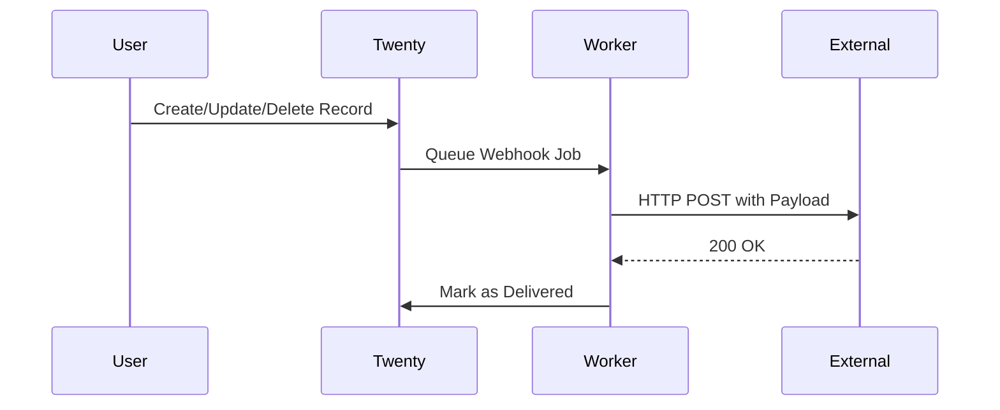

Use webhooks to receive real-time notifications when data changes in your Twenty workspace, enabling integrations with external systems.

## Overview

Webhooks allow you to:
- **React to data changes** - Get notified when records are created, updated, or deleted
- **Build integrations** - Connect Twenty with external services
- **Automate workflows** - Trigger actions in other systems
- **Sync data** - Keep external databases in sync

## How Webhooks Work



## Creating a Webhook

### Via GraphQL API

Create a webhook using the GraphQL API:

```graphql
mutation CreateWebhook {
  createWebhook(input: {
    targetUrl: "https://your-app.com/webhook"
    operations: ["person.created", "person.updated", "company.*"]
    description: "Sync contacts to external CRM"
  }) {
    id
    targetUrl
    operations
    secret
    createdAt
  }
}
```

<Tip>
  The `secret` field is automatically generated and returned once. Store it securely to verify webhook signatures.
</Tip>

### Via UI

1. Navigate to **Settings** → **API & Webhooks**
2. Click **Create Webhook**
3. Enter your endpoint URL
4. Select operations to watch
5. Save and copy the webhook secret

## Operations

Webhooks can be triggered by specific operations:

### Operation Format

Operations follow the pattern: `{object}.{action}`

- **Object** - The data type (e.g., `person`, `company`, `opportunity`)
- **Action** - The operation (`created`, `updated`, `deleted`)
- **Wildcard** - Use `*` to match all (e.g., `person.*`, `*.*`)

### Examples

<CodeGroup>
```graphql Specific Operations
operations: [
  "person.created",
  "person.updated",
  "company.created"
]
```

```graphql Wildcard for Object
operations: [
  "person.*",      # All person operations
  "company.*"      # All company operations
]
```

```graphql All Operations
operations: ["*.*"]  # All objects, all actions
```
</CodeGroup>

<Warning>
  Using `*.*` will send a webhook for every data change. This can generate high volumes of requests. Be specific when possible.
</Warning>

## Webhook Payload

### Payload Structure

Webhooks send a JSON payload via POST:

```json
{
  "id": "webhook-event-id",
  "workspaceId": "workspace-id",
  "webhookId": "webhook-id",
  "operation": "person.created",
  "timestamp": "2024-03-04T10:30:00.000Z",
  "record": {
    "id": "record-id",
    "firstName": "John",
    "lastName": "Doe",
    "email": "john@example.com",
    "jobTitle": "Software Engineer",
    "createdAt": "2024-03-04T10:30:00.000Z",
    "updatedAt": "2024-03-04T10:30:00.000Z"
  },
  "previousRecord": null
}
```

### Payload Fields

<ResponseField name="id" type="string" required>
  Unique identifier for this webhook event
</ResponseField>

<ResponseField name="workspaceId" type="string" required>
  ID of the workspace where the event occurred
</ResponseField>

<ResponseField name="webhookId" type="string" required>
  ID of the webhook configuration
</ResponseField>

<ResponseField name="operation" type="string" required>
  The operation that triggered the webhook (e.g., `person.created`)
</ResponseField>

<ResponseField name="timestamp" type="string" required>
  ISO 8601 timestamp when the event occurred
</ResponseField>

<ResponseField name="record" type="object" required>
  The current state of the record after the operation
</ResponseField>

<ResponseField name="previousRecord" type="object">
  The previous state of the record (only for `updated` and `deleted` operations)
</ResponseField>

### Update Events

For update operations, compare current and previous states:

```json
{
  "operation": "person.updated",
  "record": {
    "id": "record-id",
    "jobTitle": "Senior Software Engineer",
    "updatedAt": "2024-03-04T11:00:00.000Z"
  },
  "previousRecord": {
    "id": "record-id",
    "jobTitle": "Software Engineer",
    "updatedAt": "2024-03-04T10:30:00.000Z"
  }
}
```

## Security

### Webhook Signatures

Verify webhook authenticity using HMAC signatures:

#### Request Headers

```
X-Twenty-Signature: sha256=abc123...
X-Twenty-Timestamp: 1709546400
```

#### Verify Signature (Node.js)

```javascript
const crypto = require('crypto');

function verifyWebhookSignature(payload, signature, secret, timestamp) {
  // Reject old requests (prevent replay attacks)
  const currentTime = Math.floor(Date.now() / 1000);
  if (currentTime - timestamp > 300) { // 5 minutes
    return false;
  }
  
  // Compute expected signature
  const signedPayload = `${timestamp}.${JSON.stringify(payload)}`;
  const expectedSignature = crypto
    .createHmac('sha256', secret)
    .update(signedPayload)
    .digest('hex');
  
  // Compare signatures
  return crypto.timingSafeEqual(
    Buffer.from(signature),
    Buffer.from(`sha256=${expectedSignature}`)
  );
}

// Express.js example
app.post('/webhook', (req, res) => {
  const signature = req.headers['x-twenty-signature'];
  const timestamp = req.headers['x-twenty-timestamp'];
  const webhookSecret = process.env.TWENTY_WEBHOOK_SECRET;
  
  if (!verifyWebhookSignature(req.body, signature, webhookSecret, timestamp)) {
    return res.status(401).send('Invalid signature');
  }
  
  // Process webhook
  console.log('Valid webhook:', req.body.operation);
  res.sendStatus(200);
});
```

#### Verify Signature (Python)

```python
import hmac
import hashlib
import time
import json

def verify_webhook_signature(payload, signature, secret, timestamp):
    # Reject old requests
    current_time = int(time.time())
    if current_time - int(timestamp) > 300:  # 5 minutes
        return False
    
    # Compute expected signature
    signed_payload = f"{timestamp}.{json.dumps(payload)}"
    expected_signature = hmac.new(
        secret.encode('utf-8'),
        signed_payload.encode('utf-8'),
        hashlib.sha256
    ).hexdigest()
    
    # Compare signatures
    return hmac.compare_digest(
        signature,
        f"sha256={expected_signature}"
    )
```

### Best Practices

<CardGroup cols={2}>
  <Card title="Verify Signatures" icon="shield-check">
    Always verify webhook signatures to prevent spoofing
  </Card>
  <Card title="Use HTTPS" icon="lock">
    Only accept webhooks over HTTPS in production
  </Card>
  <Card title="Validate Timestamps" icon="clock">
    Reject old requests to prevent replay attacks
  </Card>
  <Card title="Store Secrets Securely" icon="key">
    Never commit webhook secrets to version control
  </Card>
</CardGroup>

## Retry Logic

### Automatic Retries

Twenty automatically retries failed webhook deliveries:

- **Initial attempt** - Immediate delivery
- **Retry 1** - After 1 minute
- **Retry 2** - After 5 minutes
- **Retry 3** - After 15 minutes
- **Retry 4** - After 1 hour
- **Final retry** - After 6 hours

<Info>
  Webhooks are considered failed if:
  - No response within 30 seconds
  - HTTP status code is not 2xx
  - Network error occurs
</Info>

### Responding to Webhooks

Your endpoint should:

1. **Return quickly** - Respond within 30 seconds
2. **Return 2xx status** - Any 2xx code indicates success
3. **Process asynchronously** - Queue long-running tasks

```javascript
// Good: Quick response, async processing
app.post('/webhook', async (req, res) => {
  // Verify signature
  if (!verifySignature(req)) {
    return res.status(401).send('Invalid signature');
  }
  
  // Queue for processing
  await queue.add('process-webhook', req.body);
  
  // Respond immediately
  res.sendStatus(200);
});

// Bad: Slow processing blocks response
app.post('/webhook', async (req, res) => {
  await longRunningProcess(req.body); // This might timeout!
  res.sendStatus(200);
});
```

## Managing Webhooks

### List All Webhooks

```graphql
query GetWebhooks {
  webhooks {
    id
    targetUrl
    operations
    description
    createdAt
    updatedAt
  }
}
```

### Update Webhook

```graphql
mutation UpdateWebhook {
  updateWebhook(input: {
    id: "webhook-id"
    operations: ["person.*", "company.*"]
    description: "Updated description"
  }) {
    id
    operations
    updatedAt
  }
}
```

### Delete Webhook

```graphql
mutation DeleteWebhook {
  deleteWebhook(id: "webhook-id") {
    id
  }
}
```

## Testing Webhooks

### Local Development

Use tools like ngrok to expose your local server:

```bash
# Start ngrok
ngrok http 3000

# Use the ngrok URL in your webhook
# https://abc123.ngrok.io/webhook
```

### Testing Endpoint

Create a simple test endpoint:

```javascript
const express = require('express');
const app = express();

app.use(express.json());

app.post('/webhook', (req, res) => {
  console.log('Webhook received:');
  console.log(JSON.stringify(req.body, null, 2));
  console.log('Headers:', req.headers);
  res.sendStatus(200);
});

app.listen(3000, () => {
  console.log('Webhook test server running on port 3000');
});
```

### Webhook Testing Services

Use these services to inspect webhook payloads:

- **Webhook.site** - https://webhook.site
- **RequestBin** - https://requestbin.com
- **Beeceptor** - https://beeceptor.com

## Common Use Cases

### Sync to External CRM

```javascript
app.post('/webhook/crm-sync', async (req, res) => {
  const { operation, record } = req.body;
  
  if (operation === 'person.created') {
    await externalCRM.createContact({
      firstName: record.firstName,
      lastName: record.lastName,
      email: record.email,
      source: 'twenty-crm',
    });
  }
  
  res.sendStatus(200);
});
```

### Send Notifications

```javascript
app.post('/webhook/notifications', async (req, res) => {
  const { operation, record } = req.body;
  
  if (operation === 'opportunity.created') {
    await slack.postMessage({
      channel: '#sales',
      text: `New opportunity: ${record.name} - $${record.amount}`,
    });
  }
  
  res.sendStatus(200);
});
```

### Data Warehouse Sync

```javascript
app.post('/webhook/data-warehouse', async (req, res) => {
  const { operation, record, previousRecord } = req.body;
  
  // Store in data warehouse for analytics
  await dataWarehouse.insert('crm_events', {
    operation,
    record_id: record.id,
    record_type: operation.split('.')[0],
    timestamp: new Date(),
    data: record,
    previous_data: previousRecord,
  });
  
  res.sendStatus(200);
});
```

## Monitoring

### Check Webhook Status

Monitor webhook delivery in your application:

```javascript
const deliveryStats = {
  total: 0,
  successful: 0,
  failed: 0,
};

app.post('/webhook', async (req, res) => {
  deliveryStats.total++;
  
  try {
    await processWebhook(req.body);
    deliveryStats.successful++;
    res.sendStatus(200);
  } catch (error) {
    deliveryStats.failed++;
    console.error('Webhook processing failed:', error);
    res.status(500).send('Processing error');
  }
});

app.get('/webhook/stats', (req, res) => {
  res.json(deliveryStats);
});
```

### Log Webhook Events

```javascript
app.post('/webhook', async (req, res) => {
  // Log all webhook events
  await db.webhookLogs.create({
    webhookId: req.body.webhookId,
    operation: req.body.operation,
    timestamp: new Date(),
    payload: req.body,
    headers: req.headers,
  });
  
  // Process webhook
  await processWebhook(req.body);
  res.sendStatus(200);
});
```

## Troubleshooting

<AccordionGroup>
  <Accordion title="Webhooks not being received">
    **Check:**
    - Endpoint is publicly accessible (test with curl)
    - Firewall allows inbound traffic
    - Webhook is active in Twenty settings
    - Operations match the events you're triggering
    
    **Test connectivity:**
    ```bash
    curl -X POST https://your-app.com/webhook \
      -H "Content-Type: application/json" \
      -d '{"test": true}'
    ```
  </Accordion>

  <Accordion title="Signature verification failing">
    **Common issues:**
    - Using wrong secret
    - Not including timestamp in signature calculation
    - Payload modified before verification
    - Clock skew between servers
    
    **Debug:**
    ```javascript
    console.log('Received signature:', req.headers['x-twenty-signature']);
    console.log('Received timestamp:', req.headers['x-twenty-timestamp']);
    console.log('Payload:', JSON.stringify(req.body));
    ```
  </Accordion>

  <Accordion title="Timeout errors">
    **Solutions:**
    - Respond within 30 seconds
    - Process asynchronously using job queues
    - Optimize database queries
    - Return 200 immediately, process later
  </Accordion>

  <Accordion title="Too many retries">
    **Causes:**
    - Endpoint returning non-2xx status
    - Network connectivity issues
    - Processing errors not caught
    
    **Fix:**
    ```javascript
    app.post('/webhook', async (req, res) => {
      try {
        await processWebhook(req.body);
        res.sendStatus(200); // Success
      } catch (error) {
        console.error(error);
        res.sendStatus(200); // Still return 200 to prevent retries
      }
    });
    ```
  </Accordion>
</AccordionGroup>

## Webhook Limits

- **Maximum URL length** - 2048 characters
- **Timeout** - 30 seconds per request
- **Retry attempts** - 5 retries over 6 hours
- **Payload size** - Up to 1MB

## Next Steps

<CardGroup cols={2}>
  <Card title="Building Integrations" icon="puzzle-piece" href="/developers/extending/integrations">
    Create full integrations with third-party services
  </Card>
  <Card title="GraphQL API" icon="diagram-project" href="/developers/api/graphql-api">
    Manage webhooks via GraphQL
  </Card>
  <Card title="Custom Apps" icon="cube" href="/developers/extending/custom-apps">
    Build applications that use webhooks
  </Card>
  <Card title="Authentication" icon="shield" href="/developers/api/authentication">
    Secure your webhook endpoints
  </Card>
</CardGroup>
